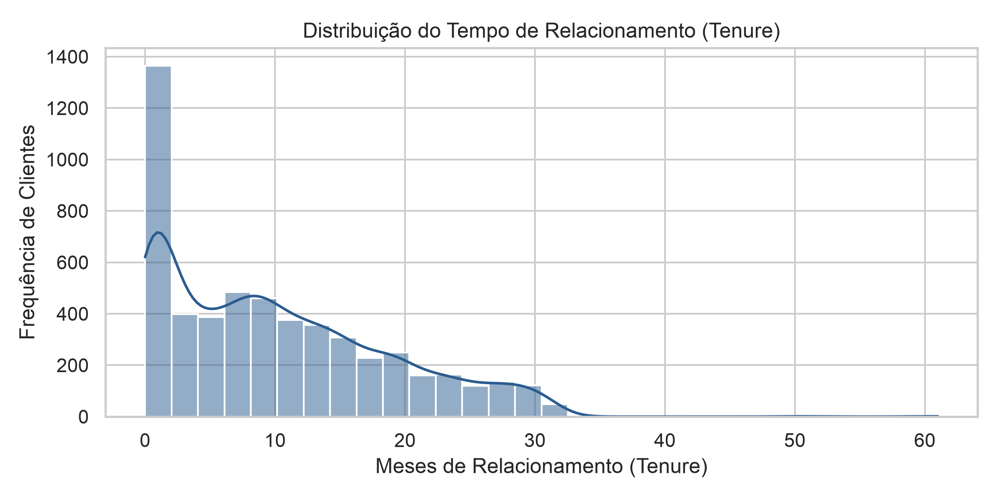
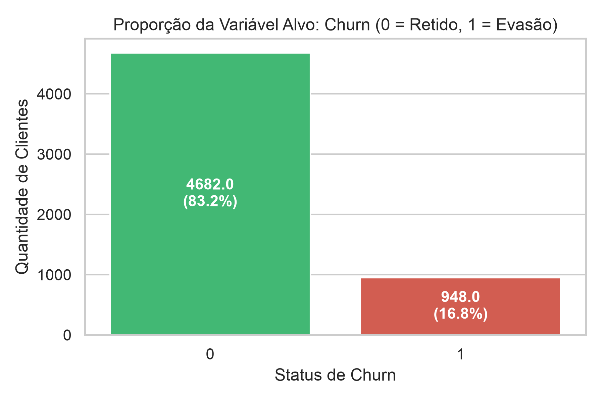
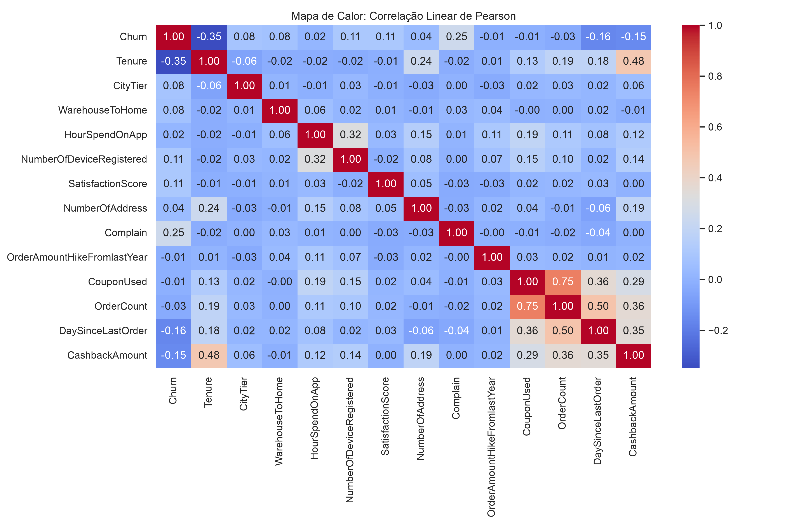
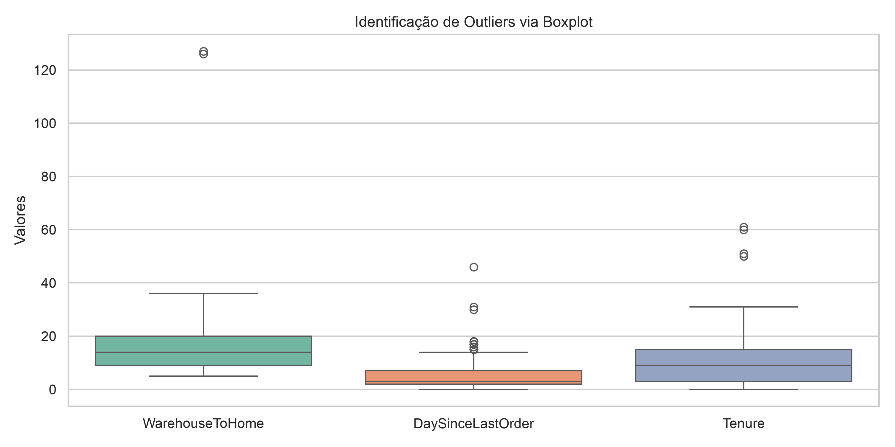
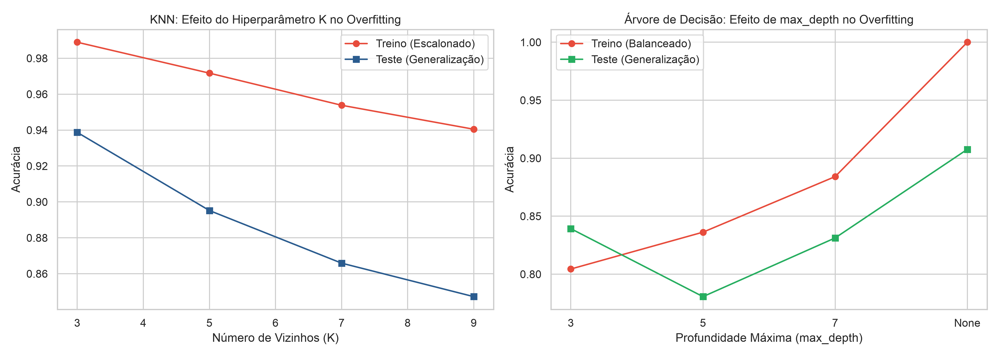

**```a princípio já que estou trabalhando em .py os gráficos serão armazenados na pasta projeto/graficos/...```**

--- 

## Fase 1: Análise exploratória (EDA)

- ```if``` Recebe o endereço do arquivo em formato de texto, converte em Path e confirma se o caminho existe, caso não, adiciona uma menssagem de erro sem travar todo processamento.
- ```return df``` retorna uma cópia pra memória.

```python
def carregar_dados(caminho_csv: str) -> pd.DataFrame: # Carrega o dataset e exibe a dimensão inicial.
    caminho = Path(caminho_csv)
    if not caminho.exists(): # apenas verifica se existe na memória.
        raise FileNotFoundError(f"Arquivo não encontrado: {caminho.resolve()}")
    df = pd.read_csv(caminho)
    print(
        f"[CARREGAMENTO] Linhas: {df.shape[0]} | Colunas: {df.shape[1]}"
    )
    return df
```

---

- ```df.info``` > exibi tipos de todas colunas.
- ```df.isnull().sum()``` > isola e soma somente os valores nulos.
- ```df.describe().T``` > gera uma estatistica descritiva completa. Exibindo colunas ao invés de linhas

```python
def relatorio_estatistico(df: pd.DataFrame) -> None: # Exibe tipos de dados, contagem de nulos e o sumário estatístico descritivo.
    print("\n--- 1. ESTRUTURA GERAL DOS DADOS ---")
    print(df.info())

    print("\n--- 2. CONTAGEM DE VALORES NULOS POR COLUNA ---")
    nulos = df.isnull().sum()
    print(nulos[nulos > 0])

    print("\n--- 3. SUMÁRIO ESTATÍSTICO DESCRITIVO ---")
    print(df.describe().T)

```

---

- **Gráficos:**

```python
def gerar_graficos_eda(df: pd.DataFrame, pasta_saida: str = "graficos") -> None: # 3 Gráficos.
    sns.set_theme(style="whitegrid")
    caminho_pasta = Path(pasta_saida)
    caminho_pasta.mkdir(parents=True, exist_ok=True)

    # Gráfico 1: Histograma de Distribuição (Tenure)
    plt.figure(figsize=(8, 4))
    sns.histplot(df["Tenure"], kde=True, color="#2b5c8f", bins=30)
    plt.title("Distribuição do Tempo de Relacionamento (Tenure)")
    plt.xlabel("Meses de Relacionamento (Tenure)")
    plt.ylabel("Frequência de Clientes")
    plt.tight_layout()
    caminho_g1 = caminho_pasta / "eda_01_distribuicao_tenure.png"
    plt.savefig(caminho_g1, dpi=300)
    plt.close()
    print(f"[GRÁFICO SALVO] {caminho_g1}")
```



---

```python
    # Gráfico 2: Desbalanceamento do Churn (com hue ajustado para evitar warning)
    plt.figure(figsize=(6, 4))
    ax = sns.countplot(
        x="Churn",
        hue="Churn",
        data=df,
        palette=["#2ecc71", "#e74c3c"],
        legend=False,
    )
    plt.title("Proporção da Variável Alvo: Churn (0 = Retido, 1 = Evasão)")
    plt.xlabel("Status de Churn")
    plt.ylabel("Quantidade de Clientes")

    total = len(df)
    for p in ax.patches:
        altura = p.get_height()
        porcentagem = f"{(altura / total) * 100:.1f}%"
        ax.annotate(
            f"{altura}\n({porcentagem})",
            (p.get_x() + p.get_width() / 2.0, altura / 2),
            ha="center",
            va="center",
            fontsize=11,
            color="white",
            weight="bold",
        )

    plt.tight_layout()
    caminho_g2 = caminho_pasta / "eda_02_desbalanceamento_churn.png"
    plt.savefig(caminho_g2, dpi=300)
    plt.close()
    print(f"[GRÁFICO SALVO] {caminho_g2}")
```



---

```python

    # Gráfico 3: Heatmap de Correlação de Pearson
    plt.figure(figsize=(12, 8))
    colunas_numericas = df.select_dtypes(include=["number"]).drop(
        columns=["CustomerID"]
    )
    matriz_corr = colunas_numericas.corr(method="pearson")

    sns.heatmap(
        matriz_corr,
        annot=True,
        fmt=".2f",
        cmap="coolwarm",
        cbar=True,
    )
    plt.title("Mapa de Calor: Correlação Linear de Pearson")
    plt.tight_layout()
    caminho_g3 = caminho_pasta / "eda_03_correlacao_pearson.png"
    plt.savefig(caminho_g3, dpi=300)
    plt.close()
    print(f"[GRÁFICO SALVO] {caminho_g3}")
```



Tomada de Decisão 

1. É visivel nessa analise que há picos incomuns tendo uma descrepancia muito grande em o que é retido, e o que há de evasão. É mostrado um desbalanceamento Severo: A base conta com cerca de 83,2% de clientes ativos (classe 0) e apenas 16,8% evadidos (classe 1). Treinar modelos diretamente sem balanceamento fará o algoritmo priorizar a classe majoritária, gerando falsos negativos críticos.


2. Dados Ausentes e Assimetria: Sete variáveis numéricas possuem valores nulos (Tenure, WarehouseToHome, HourSpendOnApp, OrderAmountHikeFromlastYear, CouponUsed, OrderCount, DaySinceLastOrder). Colunas como WarehouseToHome = 1.62 e CouponUsed = 2.55 apresentam cauda longa à direita e presença de valores extremos. Portanto, a mediana é a técnica estatisticamente recomendada para a imputação, pois a média sofreria distorção pelos outliers, sendo drasticamente alterada pelo maior valor.


3. Multicolinearidade e Relação Linear: No mapa de correlação, CustomerID não possui valor preditivo (deve ser descartado é apenas o ID), enquanto variáveis comportamentais como Complain e Tenure demonstram forte correlação com o Churn.

## Fase 2: Tratamento e Limpeza

- Removendo duplicidades organizando o mesmo peso há diferentes clientes, garantindo que o algoritimo de atenção igual.
- Pra garantir que ocorra aprendizado a remoção de duplicidade é essencial.
```python
    def tratar_duplicadas(df: pd.DataFrame) -> pd.DataFrame: # Verifica e remove linhas duplicadas para evitar redundância e viés.
        total_duplicadas = df.duplicated().sum() 
        # .duplicated olha se o DataFrame possui linhas duplicadas 
        # .sum() soma isso depois, total_suplicadas recebe o total  
        print(
            f"\n[DATA PREP] Linhas duplicadas encontradas no dataset: {total_duplicadas}"
        )

        if total_duplicadas > 0:
            df_limpo = df.drop_duplicates().copy() 
            # .drop_duplicates apaga cópias duplicadas 
            # "SettingWithCopyWarning" .copy - um novo local independente na meméria é alocado envitando aleteração no csv original
            print(
                f"[DATA PREP] Duplicadas removidas. Total de linhas atual: {len(df_limpo)}" # remoção de duplicidade é ecenssial para treinamento de um modelo
            )
            return df_limpo # remoção de duplicidade é ecencial para treinamento de um modelo

        print("[DATA PREP] Nenhuma linha duplicada detectada.")
        return df.copy()
```

---

- Por que usar mediana e não média?
- Foi confirmado altos valores longe do normal (cauda longa à direita), apenas a divisão traria uma média fora do comum.
- O que deixa a analise proporcional da mediana como a melhor escolha tendo um padrão melhor a ser ponderado.

```python
    def tratar_nulos(df: pd.DataFrame) -> pd.DataFrame: # aplica imputação pela MEDIANA nas colunas numéricas com dados ausentes.
    df_imputado = df.copy()
    colunas_com_nulos = df_imputado.columns[ # colunas_com_nulos recebe apenas os nulos
        df_imputado.isnull().any() # isnull() gera uma tabela avisando onde esta vazio verdadeiro, depois any() confirma onde é verdadeiro nessa tabela. 
    ].tolist() # separando o que for confirmado em sua lista

    print("\n--- TRATAMENTO DE VALORES NULOS VIA MEDIANA ---")
    for coluna in colunas_com_nulos: # roda o total de colunas_com_nulos
        mediana_valor = df_imputado[coluna].median() # pega o valor mediano apresentado naquela coluna
        qtd_nulos = df_imputado[coluna].isnull().sum() # quantidade de nulos apresentados
        df_imputado[coluna] = df_imputado[coluna].fillna(mediana_valor) # vasculha a coluna e sempre que encontra uma célula vazia insere a mediana geral.
        print(
            f"Coluna '{coluna}': {qtd_nulos} nulos imputados com a mediana = {mediana_valor}"
        )

    return df_imputado
```
- **Nota:** 
    - Foi adicionado a mediana geral onde se nulos fossem encontrados seria um problema.
    - Porém a mediana geral da base para OrderCount é 2.0.
    - Ao imputar 2.0, estamos atribuindo 2 pedidos para esse cliente, o que gera uma distorção controlada, mas ainda assim artificial.
    - Se esse cliente fosse alguém que comprou apenas 1 vez (ou estava inativo há muito tempo), estaríamos dobrando seu volume transacional teórico.
        - Esse não foi um requisito levantado pelo projeto, vou aceitar um erro residual para proteger a escala global dos algortimos preditivos.

---

- Demonstração da presença de valores discrepantes na base via boxplot.
- Resumindo visualmente como os dados estão espalhados.
- Deixando claro na parte colorida onde é abrangido os 50% e sua mediana representada pela linha horizontal.
- Assim como sua antena marca a variação aceitavel calculada.

```python
def gerar_graficos_outliers(df: pd.DataFrame, pasta_saida: str = "graficos") -> None:
    caminho_pasta = Path(pasta_saida)
    caminho_pasta.mkdir(parents=True, exist_ok=True)

    colunas_foco = ["WarehouseToHome", "DaySinceLastOrder", "Tenure"] 

    plt.figure(figsize=(10, 5)) # matplotlib fica por conta da parte gráfica
    sns.boxplot(data=df[colunas_foco], palette="Set2") # mediana, seaborn cuida dos calculos
    plt.title("Identificação de Outliers via Boxplot")
    plt.ylabel("Valores")
    plt.tight_layout()

    caminho_img = caminho_pasta / "prep_01_boxplots_outliers.png"
    plt.savefig(caminho_img, dpi=300)
    plt.close()
    print(f"[GRÁFICO SALVO] {caminho_img}")
```

---

- Aplica clipping (capping) nos limites interquartis (IQR 1.5x) para colunas com discrepâncias extremas.

```python
def tratar_outliers_clipping(df: pd.DataFrame, colunas: list[str]) -> pd.DataFrame:
    df_tratado = df.copy()
    print("\n--- TRATAMENTO DE OUTLIERS VIA CLIPPING (IQR) ---")
    for col in colunas:
        q1 = df_tratado[col].quantile(0.25)
        q3 = df_tratado[col].quantile(0.75)
        iqr = q3 - q1
        limite_inferior = q1 - 1.5 * iqr
        limite_superior = q3 + 1.5 * iqr

        # Aplicar recorte sem descartar clientes
        valores_antes = (
            (df_tratado[col] < limite_inferior)
            | (df_tratado[col] > limite_superior)
        ).sum()
        df_tratado[col] = df_tratado[col].clip(lower=limite_inferior, upper=limite_superior)
        print(f"Coluna '{col}': {valores_antes} valores ajustados aos limites [{limite_inferior:.1f}, {limite_superior:.1f}]")

    return df_tratado
```


- **NOTA:**
    - KNN (K-Nearest Neighbors): Classifica com base na similaridade geométrica dos k vizinhos mais próximos por meio da distância euclidiana (distância em linha reta entre observações no espaço vetorial). Valores discrepantes (outliers) distorceriam desproporcionalmente essa métrica de distância. Por isso, utilizou-se o corte estatístico do boxplot (IQR nas antenas) como limiar para o clipping, contendo as anomalias externas na borda aceitável da distribuição e protegendo o cálculo de vizinhança sem descartar nenhum cliente da base.
    - Árvore de Decisão (Decision Tree): Organiza-se como um fluxograma hierárquico de divisões binárias ("Se o valor for maior que x..."). Como analisa apenas se um valor está acima ou abaixo de um ponto de corte ordenado, a magnitude de um outlier não distorce a partição, dispensando tanto a agressividade do clipping agressivo quanto o escalonamento (trabalha em uma arvore de sim ou não).

## Fase 3: Feature Engineering (Coluna Claculadora)

- Organizando a nova variável de negócio exigida: cashback_por_pedido = CashbackAmount / OrderCount | Aplicada validação prévia de nulos e proteção contra divisão por zero evitando contaminação da base por valores infinitos ou NaN.
    - Nisso se um cliente tem um cashback_por_pedido muito alto e mesmo assim dá Churn = 1, a empresa gastou muita margem tentando reter um cliente que saiu da mesma forma (prejuízo em dobro). Agora se o cliente tem cashback_por_pedido baixo e alta fidelidade, ele é altamente lucrativo.

```python

def criar_feature_cashback_por_pedido(df: pd.DataFrame) -> pd.DataFrame:
    
    df_fe = df.copy()

    # Validação de integridade estatística
    if (
        df_fe["OrderCount"].isnull().any()
        or df_fe["CashbackAmount"].isnull().any()
    ):
        raise ValueError(
            "Detectados valores nulos nas variáveis de cálculo. Trate os nulos antes do cálculo."
        )

    # Proteção de negócio caso existisse contagem zerada de pedidos
    if (df_fe["OrderCount"] == 0).any():
        print(
            "[AVISO] Pedidos iguais a 0 detectados. Ajustando para 1 para evitar divisão por zero."
        )
        df_fe["OrderCount"] = df_fe["OrderCount"].replace(0, 1)

    # Cálculo da taxa
    df_fe["cashback_por_pedido"] = (
        df_fe["CashbackAmount"] / df_fe["OrderCount"]
    )

    print("\n--- FASE 3: FEATURE ENGINEERING ---")
    print(
        f"[NOVA FEATURE] 'cashback_por_pedido' criada. Média: {df_fe['cashback_por_pedido'].mean():.2f} | Mediana: {df_fe['cashback_por_pedido'].median():.2f}" # MÉDIA E MEDIANA
    )

    return df_fe
```

## Fase 4: Separação, Balanceamento e Escalonamento Seguro

- Unifica Strings com grafias diferentes que representam exatamente a mesma entidade no mundo real, o que é feito em mapeamentos = {...}.
- Não queremos colunas a mais representando a mesma coisa, isso fragmentaria os dados.

```python
def padronizar_categorias(df: pd.DataFrame) -> pd.DataFrame: # Padroniza nomeclaturas duplicadas na mesma colula.
    df_padrao = df.copy()
    # categorias que representam a mesma entidade não devem ter colunas separadas
    mapeamentos = { 
        "PreferredLoginDevice": {"Phone": "Mobile Phone"},
        "PreferredPaymentMode": {
            "CC": "Credit Card",
            "COD": "Cash on Delivery",
        },
        "PreferedOrderCat": {"Mobile": "Mobile Phone"},
    }
    for col, correcoes in mapeamentos.items():
        if col in df_padrao.columns:
            df_padrao[col] = df_padrao[col].replace(correcoes)

    return df_padrao
```

---

- **One-Hot Encoding** - convertendo variaveis textuais em dados binário
    - ```df_modelo.drop(columns=["CustomerID"])``` CostumerID esta representando o ID do cliente sendo apenas um número sequencial arbitrário.
        - Se o modelo enxergasse o ID, ele poderia memorizar que clientes com determinado ID saíram, decorando números em vez de aprender padrões reais de comportamento.

```python
def preparar_features_encoding(df: pd.DataFrame) -> tuple[pd.DataFrame, pd.Series]: # One-Hot Encoding - convertendo variaveis textuais em dados binário
    df_modelo = df.copy()

    # Descartando chave primária sem valor preditivo
    if "CustomerID" in df_modelo.columns:
        df_modelo = df_modelo.drop(columns=["CustomerID"]) # descarte CustomerID, aprenda comportamentos e não IDs

    df_modelo = padronizar_categorias(df_modelo) # categorias unicas

    # Separação X e y - perguntas X | respostas y
    X = df_modelo.drop(columns=["Churn"])
    y = df_modelo["Churn"]

    # One-Hot Encoding seguro
    X_encoded = pd.get_dummies(X, drop_first=True, dtype=int) # Pega colunas geradas

    print("\n--- FASE 4: ENCODING E PREPARAÇÃO ---")
    print(
        f"[ENCODING] Features preditoras: {X_encoded.shape[1]} colunas geradas."
    )

    return X_encoded, y
```

---

- Divide os dados em Treino e Teste (80% | 20%) preservando a proporção de classes, e aplica o SMOTE exclusivamente no treino.

```python
def split_estratificado_balanceado(X: pd.DataFrame, y: pd.Series, test_size: float = 0.20, random_state: int = 42) -> tuple: # Aplicr o SMOTE
    # organizar proteção absoluta contra Data Leakage.
    # random_state: int = 42 é nível de sorteio garantindo reprodutibilidade dos resultados

    # 1. Divisão Estratificada - separacao para treino
    X_train, X_test, y_train, y_test = train_test_split(
        X, y, test_size=test_size, random_state=random_state, stratify=y # stratify=y força o sorteio a manter a exata mesma taxa de Churn (rotatividade de clientes em ambos os conjuntos, os 16,8%)
    )

    print(
        f"[SPLIT] Treino original: {X_train.shape[0]} amostras | Teste original: {X_test.shape[0]} amostras"
    )
    print(f"[SPLIT] Distribuição y_train: {dict(y_train.value_counts())}")
    print(
        f"[SPLIT] Distribuição y_test (intocada): {dict(y_test.value_counts())}"
    )

    # 2. Reamostragem estritamente no treino (Anti-Leakage)
    smote = SMOTE(random_state=random_state) # os novos exemplos sintéticos gerados com base no Churn
    X_train_res, y_train_res = smote.fit_resample(X_train, y_train) # garante que o SMOTE seja aplicado estritamente e apenas nos dados de treino

    print(
        f"[SMOTE] Treino balanceado: {X_train_res.shape[0]} amostras (Classe 0: {(y_train_res == 0).sum()} | Classe 1: {(y_train_res == 1).sum()})"
    )

    return X_train_res, X_test, y_train_res, y_test
```

---

1. Sensibilidade do KNN (Distância Geométrica):
    - O KNN calcula distâncias em linha reta (distância euclidiana) no espaço vetorial.
    - Variáveis contínuas de grande magnitude (como CashbackAmount, de 0 a 325) teriam um peso centenas de vezes superior às variáveis binárias (de 0 a 1), fazendo com que o algoritmo ignorasse praticamente todo o resto da base.
    - O ```StandardScaler``` padroniza todas as variáveis para média 0 e desvio-padrão 1, impedindo que colunas com valores nominais altos dominem o cálculo de vizinhança.

2. Robustez da Árvore de Decisão (Partições Monotónicas):
    - A Árvore de Decisão avalia cada variável de forma isolada, criando regras binárias de corte ordenado (ex.: ```CashbackAmount <= 150``` ou ```Gender_Male <= 0.5```).
    - Transformar a escala dos dados não altera a ordem dos valores nem a distribuição das classes nas folhas.
    - Portanto, treinar a Árvore com dados escalonados é matematicamente desnecessário, sendo uma boa prática corporativa alimentar o modelo com os dados não escalonados.

```python
def escalonar_dados_knn(X_train: pd.DataFrame, X_test: pd.DataFrame) -> tuple[np.ndarray, np.ndarray, StandardScaler]:
    
    scaler = StandardScaler()
    X_train_knn = scaler.fit_transform(X_train)
    X_test_knn = scaler.transform(X_test)

    print(
        "[SCALER] Standard Scaler aplicado com segurança exclusivamente para uso no KNN."
    )

    return X_train_knn, X_test_knn, scaler
```

- **Nota:**
    - ```StandardScaler``` não descarta nada, aplica a fórmula estatística do **Z-score** em cada elemento x de uma coluna.
    - Quem tem exatamente o valor médio vira 0; quem estava acima da média vira um número positivo; quem estava abaixo vira um número negativo.
    - Ajustando assim o espalhamento dos dados. O resultado passa a indicar quantos desvios-padrão aquele cliente está distante da média. Por definição matemática, ao dividir pelo próprio desvio-padrão da coluna, a nova variância e o novo desvio-padrão tornam-se rigorosamente iguais a 1.
    - z = (x - μ) / σ > demorei entender.

## Fase 5: Modelagem e Validação (O Desafio do Overfitting)

- Avaliação do KNN para múltiplos valores de K organizando Treino e Teste simultaneamente.
    - Classificando novas instâncias de pontos vizinhos mais próximos

```python
def otimizar_knn(X_train: np.ndarray, y_train: pd.Series, X_test: np.ndarray, y_test: pd.Series, k_valores: list[int] = [3, 5, 7, 9]) -> pd.DataFrame:
    resultados = []

    print("\n--- EXPERIMENTAÇÃO KNN: MONITORAMENTO DE OVERFITTING ---")

    for k in k_valores: # laço de repetição iterando pela lista de hiperparâmetros exigida.
        modelo = KNeighborsClassifier(n_neighbors=k) # Instancia o estimador definindo a quantidade de vizinhos que terão direito a voto na classificação.
        modelo.fit(X_train, y_train) # Carrega o espaço vetorial com os dados de treino escalonados

        # Previsões em treino e teste
        y_pred_train = modelo.predict(X_train)
        y_pred_test = modelo.predict(X_test)

        # Calculo - taixa de acerto global
        acc_train = accuracy_score(y_train, y_pred_train)
        acc_test = accuracy_score(y_test, y_pred_test)
        f1_train = f1_score(y_train, y_pred_train)
        f1_test = f1_score(y_test, y_pred_test)


        # O termômetro do Overfitting.
        gap_acc = (acc_train - acc_test) * 100 # Se o treino estiver em 99% e o teste em 85%, o gap é de 14%, evidenciando sobreajuste severo.

        resultados.append(
            {
                "Parametro": f"K={k}",
                "Valor": k,
                "Acc_Treino": acc_train,
                "Acc_Teste": acc_test,
                "F1_Treino": f1_train,
                "F1_Teste": f1_test,
                "Gap_Overfitting_Acc(%)": gap_acc,
            }
        )

    df_res = pd.DataFrame(resultados)
    print(df_res.to_string(index=False))
    return df_res
```

---

- Agora avaliação da Arvore de Decisão para múltiplos valores de K organizando Treino e Teste simultaneamente.
    - Necessario impor limite para não acabar apenas como uma decisão.
    - Exige 100% de precisão no treino decorando casos particulares, mas perde a capacidade de prever novos clientes no teste.

```python
def otimizar_arvore(X_train: pd.DataFrame, y_train: pd.Series, X_test: pd.DataFrame, y_test: pd.Series, depth_valores: list = [3, 5, 7, None] ) -> pd.DataFrame: 
    
    resultados = []

    print("\n--- EXPERIMENTAÇÃO ÁRVORE: MONITORAMENTO DE OVERFITTING ---")
    for depth in depth_valores:
        nome_param = f"max_depth={depth}"
        modelo = DecisionTreeClassifier(max_depth=depth, random_state=42)
        modelo.fit(X_train, y_train)

        y_pred_train = modelo.predict(X_train)
        y_pred_test = modelo.predict(X_test)

        acc_train = accuracy_score(y_train, y_pred_train)
        acc_test = accuracy_score(y_test, y_pred_test)
        f1_train = f1_score(y_train, y_pred_train)
        f1_test = f1_score(y_test, y_pred_test)

        gap_acc = (acc_train - acc_test) * 100

        resultados.append(
            {
                "Parametro": nome_param,
                "Valor": str(depth),
                "Acc_Treino": acc_train,
                "Acc_Teste": acc_test,
                "F1_Treino": f1_train,
                "F1_Teste": f1_test,
                "Gap_Overfitting_Acc(%)": gap_acc,
            }
        )

    df_res = pd.DataFrame(resultados)
    print(df_res.to_string(index=False))
    return df_res
```

---

- Curvas overfitting:

```python
def gerar_graficos_overfitting( df_knn: pd.DataFrame, df_arvore: pd.DataFrame, pasta_saida: str = "graficos" ) -> None: # Plota as curvas de acurácia de Treino vs. Teste para comprovar visualmente o diagnóstico de overfitting.
    caminho_pasta = Path(pasta_saida)
    caminho_pasta.mkdir(parents=True, exist_ok=True)

    fig, axes = plt.subplots(1, 2, figsize=(14, 5))

    # Curva KNN
    axes[0].plot(
        df_knn["Valor"],
        df_knn["Acc_Treino"],
        marker="o",
        label="Treino (Escalonado)",
        color="#e74c3c",
    )
    axes[0].plot(
        df_knn["Valor"],
        df_knn["Acc_Teste"],
        marker="s",
        label="Teste (Generalização)",
        color="#2b5c8f",
    )
    axes[0].set_title("KNN: Efeito do Hiperparâmetro K no Overfitting")
    axes[0].set_xlabel("Número de Vizinhos (K)")
    axes[0].set_ylabel("Acurácia")
    axes[0].legend()
    axes[0].grid(True)

    # Curva Árvore
    axes[1].plot(
        df_arvore["Valor"],
        df_arvore["Acc_Treino"],
        marker="o",
        label="Treino (Balanceado)",
        color="#e74c3c",
    )
    axes[1].plot(
        df_arvore["Valor"],
        df_arvore["Acc_Teste"],
        marker="s",
        label="Teste (Generalização)",
        color="#27ae60",
    )
    axes[1].set_title(
        "Árvore de Decisão: Efeito de max_depth no Overfitting"
    )
    axes[1].set_xlabel("Profundidade Máxima (max_depth)")
    axes[1].set_ylabel("Acurácia")
    axes[1].legend()
    axes[1].grid(True)

    plt.tight_layout()
    caminho_img = caminho_pasta / "mod_01_curvas_overfitting.png"
    plt.savefig(caminho_img, dpi=300)
    plt.close()
    print(f"\n[GRÁFICO SALVO] {caminho_img}")
```

